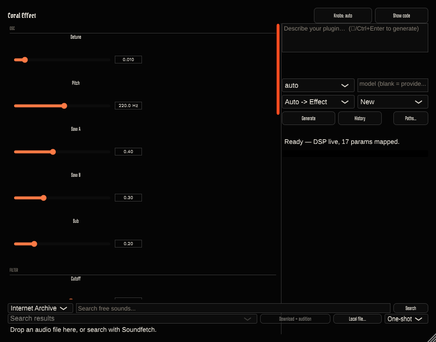
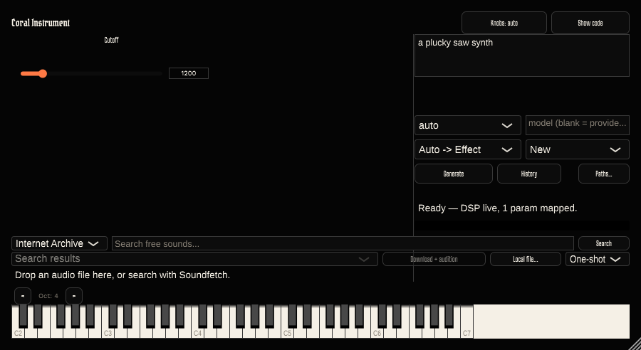
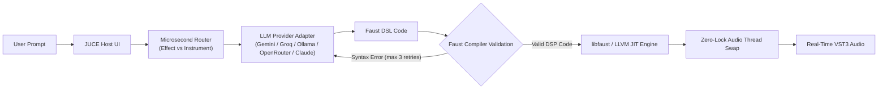

# Incant Audio

> **Prompt to Real-Time DSP Audio Plugin in Seconds.**  
> *Powered by the PluginForge Synthesis Engine.*

[](https://isocpp.org/)
[](https://juce.com/)
[](https://faust.grame.fr/)
[](https://llvm.org/)
[](LICENSE)

**Incant Audio** turns natural language descriptions into real-time VST3 audio effects and polyphonic synthesizers. Describe the sound or signal processor you want in plain English, and Incant Audio generates, validates, JIT-compiles, and loads native machine code into a live audio plugin—complete with dynamic GUI controls—without stopping playback.

---

## ⚡ Visual Showcase

<div align="center">
  
  <p><em>A generated multi-parameter patch with grouped controls, parameter mapping, and physical audio units.</em></p>
</div>

<br/>

<div align="center">
  
  <p><em>Prompt input panel, provider/effect selectors, and the integrated QWERTY &amp; on-screen auditioning keyboard.</em></p>
</div>

---

## ✨ Key Capabilities

- 🎹 **Audio Effects & Polyphonic Synths**: Describe lowpass filters, tube saturators, stereo choruses, ADSR polyphonic synthesizers, or multi-stage effect chains.
- ⚡ **Zero-Drop JIT Compilation**: Faust DSL is compiled to native machine code via `libfaust` and `LLVM` on a background thread. Dynamic DSP swapping occurs atomically with zero audio dropouts or lock contention.
- 🔄 **Self-Correcting LLM Feedback Loop**: If generated DSP fails compilation, compiler error output (`stderr`) is automatically fed back to the LLM for up to 3 repair retries.
- 🎛️ **Pre-allocated Dynamic Parameter Pool**: A fixed 64-slot dynamic parameter pool maps parameters to physical units (Hz, dB, ms, exponential/logarithmic curves) instantly exposed to host DAWs.
- 💬 **Live Iteration & Code Inspector**: View generated Faust source code directly inside the host UI. Check the **Refine** toggle to iterate on an existing DSP patch while preserving parameter settings.
- ⌨️ **Instant QWERTY & MIDI Auditioning**: Audition generated instruments immediately using your computer keyboard (QWERTY layout) or connected MIDI controllers.
- 🆓 **Provider-Agnostic LLM Layer**: Ships with free-by-default LLM integration out of the box (Gemini, Groq, OpenRouter, or local Ollama).

---

## 🏗️ Architecture & Synthesis Pipeline



### Why Faust DSL over raw C++ or JSON IR?
Generating Faust algebraic DSL instead of raw C++ or JSON intermediate representations guarantees high LLM generation reliability, mathematical conciseness, built-in real-time safety, and instant target-agnostic compilation.

---

## 🚀 Quickstart Guide

### 1. Prerequisites
- **CMake** 3.22+ & **Ninja**
- **C++17 Compiler** (GCC, Clang, or MSVC)
- **Python** 3.10+
- **JUCE 7.0.9** (pass its checkout with `-DJUCE_PATH=...`)
- **Faust & LLVM** libraries (`libfaust` 2.85+)

### 2. Environment Setup
Copy `.env.example` to `.env` and set your preferred free LLM provider API key:
```bash
cp .env.example .env
```
Supported free-tier providers: **Gemini**, **Groq**, **OpenRouter**, or local **Ollama** (`llama3`, `deepseek-r1`). Paid providers (Anthropic Claude) are supported and gated behind `PLUGINFORGE_ALLOW_PAID=1`.

### 3. Build the JUCE Host Plugin
```bash
cd host
cmake -S . -B build -G Ninja -DCMAKE_BUILD_TYPE=Release -DJUCE_PATH="$HOME/JUCE"
cmake --build build --target PluginForgeHost_Standalone PluginForgeHost_VST3 \
  PluginForgeSynth_Standalone PluginForgeSynth_VST3
```

### 4. Run & Audition
Launch either standalone application:
```bash
./build/PluginForgeHost_artefacts/Release/Standalone/PluginForge\ Host
./build/PluginForgeSynth_artefacts/Release/Standalone/PluginForge\ Synth
```

The VST3 bundles are written beneath each target's `Release/VST3` directory. To
create a versioned archive or install a packaged build locally, see
[`docs/distribution.md`](docs/distribution.md).

### Known generation limitations

- The default Ollama model needs a larger context than its stock 4096-token
  setting. Create/use a model with `num_ctx 16384` before selecting Ollama; the
  stock configuration can truncate generated Faust silently. See PF-043 in
  [`docs/BUGS.md`](docs/BUGS.md).
- A known generated noise-gate fixture compiles but renders silence because its
  threshold is converted from dB twice. Compile success alone does not establish
  audible output; see PF-032 in [`docs/BUGS.md`](docs/BUGS.md).

---

## 🔬 Audio Developer & AI Architecture Deep Dive

### Real-Time Safe Audio Thread Handshake
The DSP engine uses a lock-free `enterAudio()` / `exitAudio()` drain guard bracketing `processBlock`. Faust DSP compilation occurs entirely on a background thread. ParamPool mappings and dynamic DSP pointers publish atomically *before* setting `ready = true`, preventing TOCTOU races and eliminating parameter-lookup errors during live audio playback.

### Dynamic Parameter Mapping Protocol
Parameters are pre-allocated once in `PluginProcessor::createParameterLayout()` and dynamic Faust controls are bound using an identity-keyed pool (`ParamIdentity` + `ParamMap`). Normalized host values (0.0 to 1.0) are seamlessly converted to real-world units (Hz, dB, ms).

### Automated Verification Ladder
All codebase changes pass a multi-tier automated test ladder:
- `tools/check.sh fast` (~2s) — Unit tests & control wiring guards.
- `tools/check.sh full` (~2min) — System prompt grounding, builds, and ThreadSanitizer (TSan) safety validation.
- `tools/check.sh audio` (~1min) — Offline render oracle test over the DSP corpus to verify signal safety (no NaN, DC offset, or runaway gain).

---

## 📁 Directory & Codebase Map

```
PluginForge/
├── host/                  # JUCE 7 Host Plugin (C++17)
│   ├── Source/            # FaustEngine, ParamPool, OutputGuard, UI Panels
│   └── tests/             # Unit, SPSC ring buffer, and integration test suites
├── llm/                   # Python Synthesis & Validation Pipeline
│   ├── generate.py        # LLM invocation & Faust validation loop
│   ├── providers.py       # Adapter for Gemini, Groq, Ollama, OpenRouter, Claude
│   ├── router.py          # Microsecond regex router (Effect vs Instrument)
│   └── prompts/           # System prompts with generated Faust stdlib docs
├── bench/                 # Render Oracle & Offline Perceptual Evaluation
├── dev-cockpit/           # Web dashboard for real-time telemetry & UI monitoring
├── examples/              # Idiomatic Faust DSP patches (.dsp)
├── artifacts/             # Screenshots, UI gallery fixtures, and audio samples
├── docs/                  # Architectural Decision Records (ADRs) & specs
└── tools/                 # Build gates, RT-safety checks, and check.sh ladder
```

---

## 🤝 Agentic Engineering & Open Governance

Incant Audio is developed via an explicit human-agent pairing protocol:
- **`CLAUDE.md`**: Project invariants, toolchain configuration, real-time safety rules, and test ladder specs.
- **`COLLABORATION.md`**: Protocol governing change reports, evidence verification standards, and architectural triggers.
- **`docs/decisions.md`**: Architectural Decision Records (ADRs).
- **`docs/BUGS.md`**: Durable ID-tracked defect registry (`PF-NNN`).

---

## 📄 License & Credits

- Core Engine: **Proprietary; all rights reserved** (see [LICENSE](LICENSE)).
- JUCE, Faust, LLVM, and other dependencies remain subject to their own terms.
  Public or commercial distribution requires a separate dependency-license review.
- Built with [JUCE Framework](https://juce.com/) and [Faust DSP Compiler](https://faust.grame.fr/).
