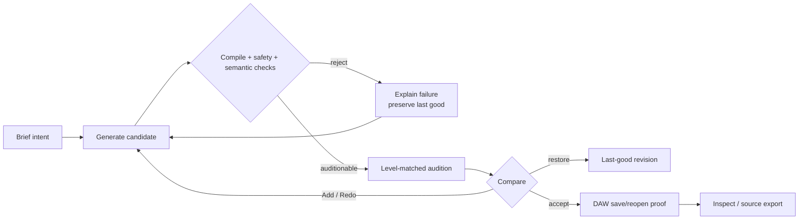
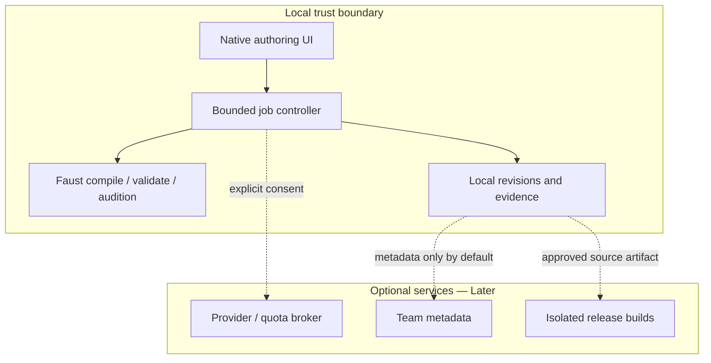

# Session 014 — PluginMaker adversarial development contract

**Date:** 2026-08-14

**Status:** Proposed for semantic review; no architecture decision is accepted by this document

**Branch/worktree:** `codex-analysis` / `/home/losera/PluginForge-codex-analysis`

**Research method:** Lead synthesis of independent UX/UI, DSP/backend, platform/security,
and Product Management reviews. External sources were accessed 2026-08-14.

## 1. Executive contract

PluginMaker's strongest public advantage is a complete journey, not demonstrated superior
DSP: describe a plugin, refine sound and appearance in a browser, download signed VST3/AU
builds, then purchase enterprise distribution services. Incant Audio should not answer
that with a wider one-shot generator or more decorative skins. It should win on a tighter
loop:

> **Describe → hear → compare → refine or restore → reopen in a DAW → inspect and export
> evidence.**

The proposed beachhead is technically curious electronic musicians and sound designers
who want a personal effect they can audition and refine without losing access to source.
DSP-capable developers are a secondary persona. Effects-first is recommended until DAW
state, automation, real-time behavior, and semantic fidelity have evidence; supporting
instruments at equal product depth is a separate human decision.

The near-term product is local-first. Faust remains the DSP contract, the accepted
64-slot host parameter scheme remains stable, and native JUCE remains the runtime UI.
Generated UI intent should be constrained, versioned metadata rendered and checked by
deterministic native code—not pixels, arbitrary C++/HTML, or an untestable image.

This contract authorizes research and planning only. It does **not** authorize a new
Project schema, UI IR schema revision, writable local API, cloud data path, build system,
distribution system, parameter contract change, or ADR. Those are individually
human-gated in dependency order.

## 2. What is known, claimed, and hypothesized

| Class | Statement | Confidence / evidence |
|---|---|---|
| Local evidence | Incant uses Faust DSL, embedded LLVM JIT, and 64 predeclared host slots. | Accepted constraints (`CLAUDE.md:22-32`; `docs/decisions.md:8-54,82-102`). |
| Local evidence | UI IR v1 describes archetype, tokens, sections, spans, control style, and size; malformed/future schemas fall back. | `host/Source/UiIr.h:6-57,69-121`. |
| Local evidence | LLM UI-IR emission is not implemented; v1 is hand-authored only. | `host/Source/UiIr.h:21-22`. |
| Local evidence | Unknown/unassigned compiled controls are appended instead of hidden. | `host/Source/ParamGridPanel.cpp:401-475`. |
| Local evidence | UI IR rendering exists but recent repo research found it unreachable and section headings unpainted. | `docs/decisions.md:714-786`; re-check before implementation because concurrent work exists. |
| Local evidence | Runtime mapping/swap/output safety is substantial, but existing concurrency stress is not a proof of every lifecycle. | `host/Source/FaustEngine.h:250-272`; `host/Source/FaustEngine.cpp:902-959`; `host/Source/ParamPool.cpp:38-212`; `host/Source/OutputGuard.cpp:26-145`. |
| Local evidence | The product has not been validated in a real DAW according to the session orientation digest. | `tools/status_digest.sh` output on 2026-08-14; status source was six days stale, so treat this as an open verification item. |
| Local evidence | Current repo export is not a product capability: it emits passthrough/invalid code and is explicitly stubbed. | `tools/export_repo.py:70-114`; `docs/decisions.md:857-944`. |
| Competitor claim | PluginMaker generates DSP and a polished UI, supports browser refinement, signed macOS/Windows VST3/AU, and enterprise distribution. | [Official PluginMaker product page](https://www.pluginmaker.ai/). Claims were not independently tested. |
| Competitor claim | Imagine Plugins provides constrained DSP chains, GUI design/patching, browser/DAW audition, and reviewed VST3/AU/AAX delivery. | [Official Imagine Plugins page](https://www.imagineplugins.com/). Claims were not independently tested. |
| Hypothesis | Recoverability, inspectability, and in-DAW continuity can beat broader but opaque generation. | Must be tested with musicians; not a current product fact. |
| Hypothesis | Semantic UI IR plus deterministic rendering will improve task success over the current grid. | Requires a bounded experiment; “beautiful UI” is not an engineering acceptance criterion. |

### Identity note

“PluginMaker” in this review means `pluginmaker.ai` with high confidence. It is not
PluginForge, which is Incant Audio's internal engine (`CLAUDE.md:3-20`).

## 3. Adversarial competitor verdict

| Dimension | PluginMaker public position | Incant opportunity | Incant liability today |
|---|---|---|---|
| First value | Browser-generated audible plugin | Native/offline audition and last-good safety | No comparative time-to-accepted-result evidence |
| Refinement | Sound and look in browser | Explicit Add vs Redo, source-aware diffs, restore | No durable candidate comparison proven in DAW |
| Interface | Claims polished generated UI | Constrained semantic layout, accessibility, developer override | UI IR is not an evidenced end-to-end generation path |
| Trust | SaaS hides implementation details | Provider/model/cost/repair/safety provenance | Current telemetry and attempt lineage are incomplete |
| Developer control | Faust export appears in FAQ, answer unavailable | Inspect/edit/import/export source through one safety path | Export generator is broken and must remain unsupported |
| Distribution | Signed cross-platform binaries and enterprise tooling | Reproducible AOT source first, managed release later | No clean build, real host, signing, licensing, or support matrix |

The adversarial warning is simple: copying PluginMaker's browser and distribution surface
before proving Incant's DAW behavior would copy its cost structure while abandoning
Incant's most credible differentiators. Likewise, treating “every parameter has a knob”
as UI generation would confuse completeness with design.

## 4. Product definition

### Beachhead job

> When I have a sound idea, help me turn it into an audible, editable, recallable effect
> in minutes; let me compare revisions and recover the last good result; prove it behaves
> safely in my DAW; and let me inspect or export source when I need control.

### Primary loop

### Product surfaces

Use one continuous task model, not a wizard:

1. **Brief** — musical intent, input/output assumptions, required controls, constraints,
   optional reference material.
2. **Sound** — audition input, bypass, loudness-matched A/B, Add/Redo, restore last good.
3. **Interface** — generated hierarchy, control importance, mappings, accessibility and
   responsive previews.
4. **Inspect** — Faust, UI metadata, diffs, errors, model/provider/cost and test evidence.
5. **Validate & Ship** — host matrix, state/automation evidence, source build status;
   signing and commercial release remain later.

Advanced evidence is collapsed, never destroyed. A musician need not see Faust; a
developer need not leave the project to see it.

### North star

Median time from first prompt to a user-accepted revision that subsequently reopens
successfully in a supported DAW project.

Do not set a target until the event definition, corpus, hardware, host, provider,
denominator, confidence interval, and failure taxonomy are frozen. Guardrails are:
accepted-revision rate, first/eventual compile rate, crashes/hangs/safety interventions,
DAW state/automation recall, abandonment, cost per accepted revision, and accessible task
completion.

## 5. Proposed UX and UI-generation contract

### Authority boundaries

1. **Compiled DSP metadata is authoritative** for parameter identity, kind, min/max,
   default, units, curve, automation eligibility, and meter direction.
2. A semantic planner may propose group, importance, perceptual description, dependency,
   presentation style, and focus order.
3. A versioned UI IR carries only approved declarative concepts.
4. Deterministic native JUCE code validates, reconciles, lays out, and renders it.
5. The user may lock DSP or UI, choose an explainable variant, edit metadata, and restore
   any last-good pair.
6. Missing, invalid, duplicate, inaccessible, or future metadata must degrade to the safe
   deterministic layout without dropping a compiled control.

### Architecture options requiring later approval

| Option | Benefit | Cost / failure mode | Recommendation |
|---|---|---|---|
| Keep v1 + deterministic group synthesis | Smallest contract change; uses compiled Faust group metadata | Limited salience, dependencies, accessibility semantics | **First experiment** |
| UI IR v2 semantic schema | Testable richer hierarchy, focus/help/responsive rules | Multi-consumer schema, migrations, prompt headroom, more invalid states | Propose only after v1 baseline |
| LLM emits HTML/CSS/JUCE | Maximum visual freedom | Executable/unbounded output, accessibility drift, packaging and test burden | Reject for runtime |
| Image/screenshot generation | Fast visual novelty | No semantic controls, responsiveness, automation or accessibility | Reject as primary UI |
| Runtime WebView | Rapid browser UI iteration | Reopens accepted dependency/distribution decision | No-go absent measured trigger in ADR-019 |

### Generated-UI validity

A generated layout is invalid if it loses or duplicates a writable control, maps a
discrete control to continuous behavior, permits writing a meter, clips required labels,
has unreachable actions, violates supported contrast/focus/scale rules, or changes DSP/
automation identity during a UI-only edit. Visual novelty is not a validity measure.

Accessibility targets should draw from WCAG 2.2's keyboard, focus, contrast, target-size,
name/role/value, status-message and 200% scaling principles, adapted and tested in JUCE
and real DAW hosts ([W3C WCAG 2.2](https://www.w3.org/TR/WCAG22/)). Native plugin
accessibility must be verified directly; web conformance cannot be inferred.

### Failure and trust record

Every attempt should eventually expose: intent/classification, model/provider/profile,
local/cloud boundary, estimated and actual cost, attempts and repairs, DSP/UI hashes,
safety/test outcomes, audition conditions, whether prior source was used, and the preserved
last-good revision. This is a proposed product record, not approval for a universal schema.

## 6. DSP, backend, and performance contract

### Invariants to preserve

- No allocation, lock, logging, map/string lookup, compilation, destruction, network or
  filesystem work on the audio callback.
- `ready == true` means DSP pointer, channel/voice metadata, and parameter zones describe
  the same live instance; old instances are destroyed only after readers drain.
- Meters flow DSP→UI and writable parameters host→DSP.
- A rejected, timed-out, crashed or over-budget candidate never replaces last known good.
- No non-finite sample reaches output; guard intervention is visible and recoverable.
- Every benchmark/export records Faust, libfaust, LLVM, JUCE, compiler, flags, stdlib hash,
  OS, CPU and ISA.

These are contract requirements. Existing code provides evidence for parts of them; this
document does not claim complete verification.

### Validation layers

| Layer | Question | Evidence instrument |
|---|---|---|
| Structural | Does it compile and obey I/O, voice, parameter and resource contracts? | Faust compiler, metadata checks, explicit budgets |
| Signal safety | Is output finite, bounded, non-silent where expected, and stable under hostile trajectories? | Render oracle, property corpus, sanitizer and resource tests |
| DSP semantics | Does a filter/delay/dynamics/oscillator behave like its declared family? | Magnitude, decay, pitch/harmonic, ballistic and modulation tests |
| Musical intent | Does it sound useful and match the request? | Blinded, loudness-matched human comparison and rubric |

Faust itself recommends compiling, inspecting generated metadata/graphs, measuring and
listening; compile success does not establish meaningful audio
([Faust LLM guidance](https://faustdoc.grame.fr/manual/llm/)). Formal MUSHRA is useful
where a meaningful reference and anchors exist, not as a universal creative score
([ITU-R BS.1534](https://www.itu.int/rec/R-REC-BS.1534/en)).

### Performance matrix before claims

Measure 44.1/48/96 kHz × block 32/64/128/512/2048 × 0/16/64 parameters × mono/stereo ×
effect/instrument × idle/automation-extrema/denormal/feedback stress. Record JIT p50/p95/
p99, memory/factory growth, first-block time, callback p99.999/max and deadline misses,
swap gap/click, CPU, guard trips and teardown latency. Derive release budgets from
baseline hardware; do not import arbitrary SLOs.

### Containment alternatives

| Runtime | Benefit | Risk | Position |
|---|---|---|---|
| Current in-process JIT | Lowest integration/latency burden | Compiler/native DSP shares DAW crash domain | Retain while measured |
| Isolated compile/JIT worker | Contains compile hangs/crashes; supports resource caps | Artifact ABI/ISA compatibility; native DSP still in DAW | Human-gated experiment after core evidence |
| Out-of-process DSP | Strong containment | IPC buffers, latency, RT scheduling, copies, host complexity | Research only |
| Wasm/interpreter | Portable containment hypothesis | RT performance/integration unproven | Research only |

LLVM documents separate JIT executors as a security improvement, but that is mechanism
evidence—not proof it fits an audio callback
([LLVM JITLink](https://releases.llvm.org/16.0.0/docs/JITLink.html)).

## 7. Parameter and DAW contract: unresolved tension

Stable `macro_0..63` IDs protect host recall and automation across dynamically loaded
patches. Semantic names/ranges vary per patch. Renaming host-visible metadata dynamically
does not automatically make that safe: VST3 parameter-title changes require host restart
notification, and host behavior must be measured
([VST3 parameters](https://steinbergmedia.github.io/vst3_dev_portal/pages/Technical%2BDocumentation/Parameters%2BAutomation/Index.html)).

Therefore:

- Do not change IDs/count/ranges or promise semantic DAW lanes in this plan.
- First test supported hosts for alias/title refresh, save/reload, existing automation and
  UI-only regeneration behavior.
- If safe aliases are not portable, disclose stable Macro N automation and provide a clear
  mapping view/export rather than inventing a false abstraction.
- Any change to host identity, range or migration behavior is a separate architecture and
  persistent-contract decision.

## 8. Platform, cloud, and security contract

### Proposed boundary—not yet approved

Audio processing never depends on cloud availability. Existing accepted revisions remain
playable, inspectable and editable offline. The smallest local persistence contract should
be derived from demonstrated A/B/restore/reopen operations; “Project” must not become a
universal platform schema that duplicates Faust or the parameter map.

### Current cockpit finding

The development cockpit is read-only, single-threaded, singleton-state, and can be bound
beyond loopback without authentication/origin/session controls
(`dev-cockpit/server.py:28-61,154-181`). It is not a writable product API. No write path
should ship until per-instance isolation, authentication, strict origin policy, redaction,
idempotency, cancellation and concurrency tests exist.

### Principal threats

Prompt/tool injection; browser CSRF/DNS rebinding/LAN access; cross-instance state leaks;
provider exfiltration; retry bill shock; path/name/build injection; compiler resource
exhaustion; signing-key or runner compromise; artifact substitution; dependency/license
contamination; and telemetry leakage of prompt, source, audio, paths or secrets.

Required controls include narrow typed commands, loopback/Unix sockets, random per-instance
sessions and private directories, no secrets in model context, keychain/KMS/OIDC custody,
bounded ephemeral builds, canonical paths, SBOM and signed provenance, release approval,
audit/revocation/rollback, and telemetry redaction by default. NIST's Govern/Map/Measure/
Manage lifecycle and OWASP's excessive-agency analysis are useful threat-model inputs,
not certifications ([NIST AI RMF](https://www.nist.gov/itl/ai-risk-management-framework),
[OWASP LLM06](https://owasp.org/www-project-top-10-for-large-language-model-applications/2_0_vulns/LLM06_ExcessiveAgency.html)).

### Build versus buy

Build Incant-specific revision/job/UI/DSP validation, cost-policy and approval semantics.
Adopt commodity telemetry, identity, queues, storage, secret custody, CI, signing,
attestation and SBOM/license scanning after fit tests. Defer general agent frameworks,
Kubernetes, CRDT-everywhere, multi-cloud and custom model serving until measured demand.

## 9. Development sequence and exit gates

### Now — evidence before expansion

| Epic | Work | Dependency | Exit gate |
|---|---|---|---|
| E0 Baseline protocol | Freeze tasks, corpus, hardware, event definitions and failure taxonomy | None | Reproducible run manifest; no unqualified reliability number |
| E1 DAW/RT truth | pluginval + initial host; save/reopen; automation; sample-rate/swap/shutdown races; hostile DSP resources | E0 | Declared matrix completes without unexplained crash/hang; state/automation behavior documented; deadline/glitch distributions reported |
| E2 Recovery UX pilot | Prompt→audition→A/B→Add/Redo→restore→reopen; plain-language and raw diagnostics | E0, minimal persistence review | 8–12 beachhead users observed; failures and recovery behavior reported before setting thresholds |
| E3 Bounded UI experiment | Wire existing semantic groups, validate/fallback/render; compare current grid vs constrained variants | E0, existing v1 only initially | End-to-end corpus; no lost controls; malformed metadata safe; keyboard/focus/contrast/scale evidence; blinded task comparison |
| E4 Semantic audio evidence | Family tests plus blinded, loudness-matched listening | E0, E1 | Results segmented by family/provider; agreement and uncertainty reported |

### Next — only after Now gates

- Define the minimal versioned revision record and migration/rollback fixtures from E2.
- Add guided clarification and parameter priority/progressive disclosure.
- Provide developer inspect/edit/import and reproducibility bundle through the same safety
  path.
- Secure a private read-only diagnostics surface; propose any writable controller/API
  separately.
- Rewrite export around Faust AOT static C++ **source** and validate a clean build.

Faust supports ahead-of-time C++ generation; source export avoids shipping JIT/compiler
state in the generated plugin ([Faust compiler options](https://faustdoc.grame.fr/manual/options/)).

### Later — separate businesses

Optional provider/quota broker, team revision review, managed builds, signing/notarization,
installers/licensing, and marketplace. Each requires demand, economics, legal/security and
architecture approval. Apple requires Developer ID signing/hardened runtime/notarization
for direct distribution; that is a product operation, not an export checkbox
([Apple notarization](https://developer.apple.com/documentation/security/notarizing-macos-software-before-distribution)).

### Explicit current non-goals

Marketplace; enterprise licensing; collaboration; browser/mobile authoring; cloud audio;
managed signed binaries; arbitrary formats/platforms; generative visual art; runtime
WebView; CRDT; generic agent framework; Kubernetes/multi-cloud; and production binary
export.

## 10. User research and competitive test

1. Formative: 8–12 musicians/sound designers and 4–6 DSP developers using real recent
   “I wish I had…” needs.
2. Counterbalanced benchmark: the same tape-saturation and basic synth/effect tasks in
   Incant, PluginMaker and a constrained builder where access permits.
3. Failure task: recover from invalid or musically poor generation without restarting.
4. Persistence task: save, close and reopen in a declared DAW; write/read automation.
5. Developer task: inspect and modify DSP without losing UI/state.
6. Longitudinal: two weeks, three real sessions, requiring one reused project.

Measure time to first sound and first kept result, independent recovery, turns/cost,
regression after refinement, restore usage, mapping corrections, DAW recall, task ease,
workload, trust calibration, next-day reuse, blinded intent match and accessible task
completion. Music-interface evaluation must include creative practice, not only lab task
speed ([NIME evaluation review](https://www.nime.org/proc/nime2011_johnston/)).

## 11. Go/no-go rules

**Go now:** baseline instrumentation; one supported DAW alpha; measured RT/perceptual
validation; revision/recovery study; bounded v1 UI-IR/group experiment.

**No-go now:** public superiority/reliability claims; “any plugin” promise; writable
network cockpit; binary export; cloud audio; marketplace; enterprise platform.

**Alpha go:** only after agreed host/state/automation, runtime safety/performance, and
observed beachhead workflow gates pass.

**Beta go:** only after longitudinal reuse/retention and support burden are known.

**Distribution go:** only after reproducible source export, clean builds, real-host audio
equivalence, unique plugin identity, dependency/license review, SBOM/provenance,
signing/notarization and rollback evidence. `pluginval` is a useful cross-platform
validator and supports headless CI, but is not a substitute for real hosts
([pluginval](https://github.com/Tracktion/pluginval)).

## 12. Human decision queue

Approve or reject these one at a time, at the named dependency—not as a bundle:

1. **Beachhead:** effects-only alpha versus effects+instruments; initial OS and DAW matrix.
2. **Host parameter policy:** fixed-slot disclosure/mapping versus a researched semantic
   alias strategy; no ID/range migration is proposed here.
3. **Minimal revision contract:** operations, fields, versioning, migration and rollback
   after the recovery pilot.
4. **UI authority/schema:** whether v1 evidence justifies a v2 semantic/accessibility IR.
5. **Local controller boundary:** writable API, transport, permissions and threat model.
6. **Compile containment trigger:** when measured risk justifies an isolated-worker study.
7. **AOT export:** source artifact, build identity, dependency and licensing contract.
8. **Cloud/release boundary:** consent, data classes, telemetry, provider economics,
   signing custody and support obligations.

## 13. Adversarial pre-mortem

- **We optimize screenshots and users abandon bad sounds.** Countermeasure: accepted-and-
  reopened revision is the north star; listening evidence gates UI polish claims.
- **A “Project” schema becomes a second DSP model.** Countermeasure: derive minimal fields
  from restore/reopen operations; Faust remains authoritative.
- **Semantic DAW labels corrupt old automation.** Countermeasure: preserve slot IDs/ranges,
  test host alias behavior, disclose limitations.
- **Cloud parity consumes the team before local value is proven.** Countermeasure: cloud,
  signing, licensing and collaboration stay Later with independent business cases.
- **JIT/resource failure crashes a user's DAW.** Countermeasure: hostile corpus, budgets,
  last-good rejection, deterministic lifecycle tests, then a bounded isolation experiment.
- **Generated UI becomes inaccessible or unstable.** Countermeasure: deterministic
  renderer/validator/fallback, stable identities, accessibility checks and UI-only diffs.
- **We publish impressive but irreproducible numbers.** Countermeasure: frozen corpus and
  fingerprints, denominators, distributions, confidence intervals and explicit unknowns.
- **Export creates a support and licensing product by accident.** Countermeasure: source
  export first; binary distribution is a separate go/no-go.

## 14. Verification state of this document

Performed:

- Repository/branch/worktree/status/recent-history orientation.
- Full project instruction and collaboration-protocol read.
- Read-only source/ADR/session inspection by four roles.
- Current public primary-source research, accessed 2026-08-14.
- Adversarial PM scope and dependency review.

Not performed:

- No build, unit test, sanitizer, render, benchmark, provider call, DAW test, usability
  study, accessibility test, competitor hands-on trial, penetration test, clean export,
  signing/notarization, license-counsel review or CI run.
- CI for `codex-analysis` is unknown because `gh` could not reach GitHub during orientation.
- `STATUS.md` was six days stale; every status-derived claim is treated as an open item.
- No architecture decision or external product claim has been independently accepted.
